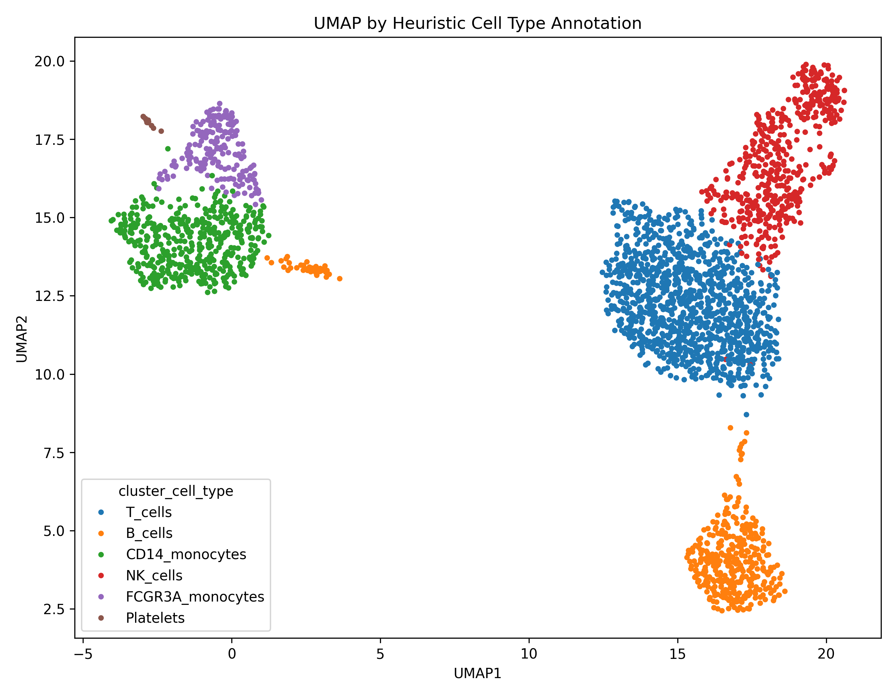
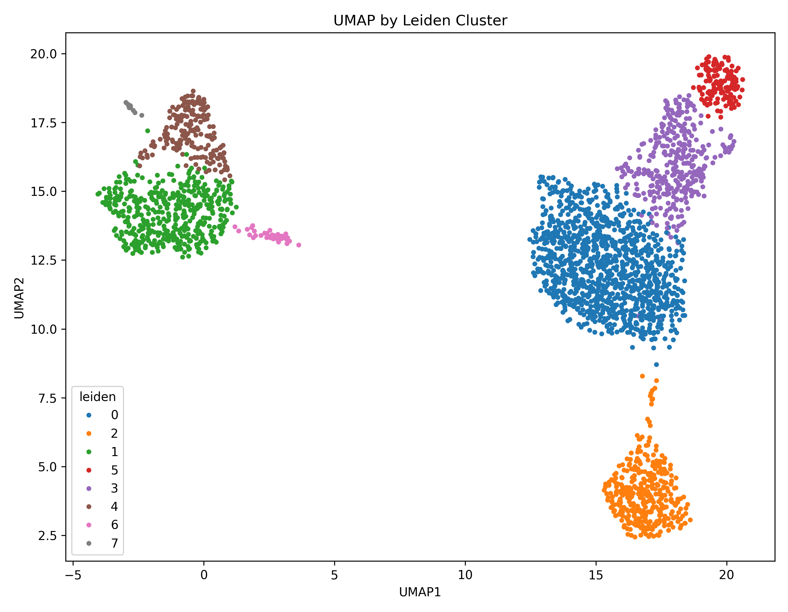
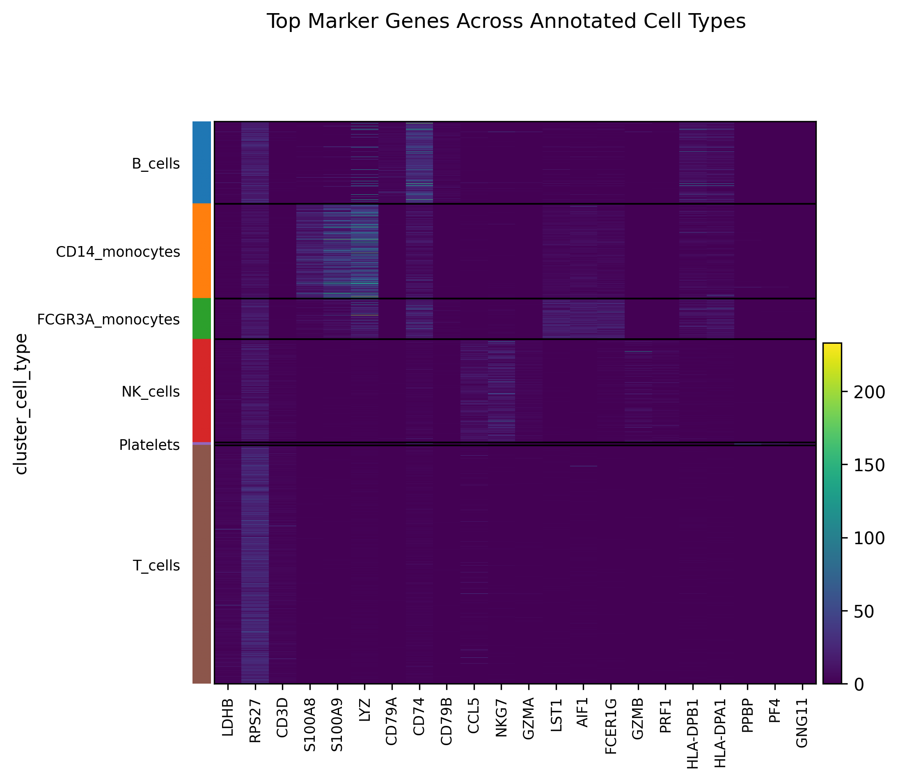
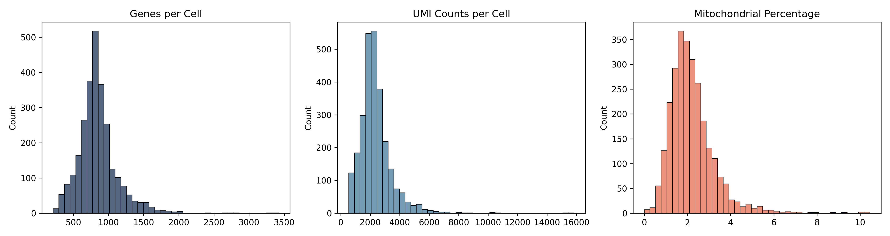

# Single-cell RNA-seq Analysis Pipeline

This repository contains an end-to-end Python pipeline for single-cell RNA-seq analysis on a real public dataset.

The workflow uses the 10x Genomics PBMC 3k dataset, starting from the raw 10x count matrix and proceeding through quality control, filtering, normalization, dimensionality reduction, clustering, marker gene analysis, and broad cell type annotation. The pipeline generates figures, summary tables, and a short report automatically.

## Pipeline Architecture

```svg
<svg width="100%" viewBox="0 0 680 620" xmlns="http://www.w3.org/2000/svg">
  <!-- Input -->
  <rect x="220" y="20" width="240" height="52" rx="8" fill="#f1efe8" stroke="#888780" stroke-width="0.5"/>
  <text x="340" y="42" text-anchor="middle" font-family="sans-serif" font-size="14" font-weight="500" fill="#2c2c2a">Raw 10x matrix</text>
  <text x="340" y="60" text-anchor="middle" font-family="sans-serif" font-size="12" fill="#5f5e5a">Filtered gene-barcode matrix</text>
  <line x1="340" y1="72" x2="340" y2="96" stroke="#1c3f8f" stroke-width="1.5" marker-end="url(#arrow)"/>
  <!-- QC -->
  <rect x="220" y="96" width="240" height="52" rx="8" fill="#e6f1fb" stroke="#185fa5" stroke-width="0.5"/>
  <text x="340" y="118" text-anchor="middle" font-family="sans-serif" font-size="14" font-weight="500" fill="#0c447c">Quality control</text>
  <text x="340" y="136" text-anchor="middle" font-family="sans-serif" font-size="12" fill="#185fa5">Filter cells · remove mito outliers</text>
  <line x1="460" y1="122" x2="506" y2="122" stroke="#b4b2a9" stroke-width="0.5" stroke-dasharray="3 3"/>
  <rect x="506" y="108" width="134" height="28" rx="6" fill="#f1efe8" stroke="#b4b2a9" stroke-width="0.5"/>
  <text x="573" y="122" text-anchor="middle" dominant-baseline="central" font-family="sans-serif" font-size="11" fill="#5f5e5a">qc_histograms.png</text>
  <line x1="340" y1="148" x2="340" y2="172" stroke="#1c3f8f" stroke-width="1.5" marker-end="url(#arrow)"/>
  <!-- Normalization -->
  <rect x="220" y="172" width="240" height="52" rx="8" fill="#e6f1fb" stroke="#185fa5" stroke-width="0.5"/>
  <text x="340" y="194" text-anchor="middle" font-family="sans-serif" font-size="14" font-weight="500" fill="#0c447c">Normalization</text>
  <text x="340" y="212" text-anchor="middle" font-family="sans-serif" font-size="12" fill="#185fa5">Scran normalize · log1p transform</text>
  <line x1="340" y1="224" x2="340" y2="248" stroke="#1c3f8f" stroke-width="1.5" marker-end="url(#arrow)"/>
  <!-- HVG + PCA -->
  <rect x="220" y="248" width="240" height="52" rx="8" fill="#e6f1fb" stroke="#185fa5" stroke-width="0.5"/>
  <text x="340" y="270" text-anchor="middle" font-family="sans-serif" font-size="14" font-weight="500" fill="#0c447c">Feature selection</text>
  <text x="340" y="288" text-anchor="middle" font-family="sans-serif" font-size="12" fill="#185fa5">Highly variable genes · PCA</text>
  <line x1="340" y1="300" x2="340" y2="324" stroke="#1c3f8f" stroke-width="1.5" marker-end="url(#arrow)"/>
  <!-- Graph + UMAP -->
  <rect x="220" y="324" width="240" height="52" rx="8" fill="#e6f1fb" stroke="#185fa5" stroke-width="0.5"/>
  <text x="340" y="346" text-anchor="middle" font-family="sans-serif" font-size="14" font-weight="500" fill="#0c447c">Graph + embedding</text>
  <text x="340" y="364" text-anchor="middle" font-family="sans-serif" font-size="12" fill="#185fa5">KNN graph · UMAP</text>
  <line x1="460" y1="350" x2="506" y2="350" stroke="#b4b2a9" stroke-width="0.5" stroke-dasharray="3 3"/>
  <rect x="506" y="336" width="134" height="28" rx="6" fill="#f1efe8" stroke="#b4b2a9" stroke-width="0.5"/>
  <text x="573" y="350" text-anchor="middle" dominant-baseline="central" font-family="sans-serif" font-size="11" fill="#5f5e5a">umap_clusters.png</text>
  <line x1="340" y1="376" x2="340" y2="400" stroke="#1c3f8f" stroke-width="1.5" marker-end="url(#arrow)"/>
  <!-- Clustering -->
  <rect x="220" y="400" width="240" height="52" rx="8" fill="#e6f1fb" stroke="#185fa5" stroke-width="0.5"/>
  <text x="340" y="422" text-anchor="middle" font-family="sans-serif" font-size="14" font-weight="500" fill="#0c447c">Leiden clustering</text>
  <text x="340" y="440" text-anchor="middle" font-family="sans-serif" font-size="12" fill="#185fa5">8 clusters · marker gene scoring</text>
  <line x1="460" y1="426" x2="506" y2="426" stroke="#b4b2a9" stroke-width="0.5" stroke-dasharray="3 3"/>
  <rect x="506" y="412" width="134" height="28" rx="6" fill="#f1efe8" stroke="#b4b2a9" stroke-width="0.5"/>
  <text x="573" y="426" text-anchor="middle" dominant-baseline="central" font-family="sans-serif" font-size="11" fill="#5f5e5a">marker_heatmap.png</text>
  <line x1="340" y1="452" x2="340" y2="476" stroke="#1c3f8f" stroke-width="1.5" marker-end="url(#arrow)"/>
  <!-- Annotation -->
  <rect x="220" y="476" width="240" height="52" rx="8" fill="#eeedfe" stroke="#534ab7" stroke-width="0.5"/>
  <text x="340" y="498" text-anchor="middle" font-family="sans-serif" font-size="14" font-weight="500" fill="#3c3489">Cell type annotation</text>
  <text x="340" y="516" text-anchor="middle" font-family="sans-serif" font-size="12" fill="#534ab7">Canonical marker panels · 6 types</text>
  <line x1="460" y1="502" x2="506" y2="502" stroke="#b4b2a9" stroke-width="0.5" stroke-dasharray="3 3"/>
  <rect x="506" y="488" width="134" height="28" rx="6" fill="#f1efe8" stroke="#b4b2a9" stroke-width="0.5"/>
  <text x="573" y="502" text-anchor="middle" dominant-baseline="central" font-family="sans-serif" font-size="11" fill="#5f5e5a">umap_cell_types.png</text>
  <line x1="340" y1="528" x2="340" y2="552" stroke="#534ab7" stroke-width="1.5" marker-end="url(#arrow)"/>
  <!-- Final output -->
  <rect x="220" y="552" width="240" height="44" rx="8" fill="#eeedfe" stroke="#534ab7" stroke-width="0.5"/>
  <text x="340" y="574" text-anchor="middle" dominant-baseline="central" font-family="sans-serif" font-size="14" font-weight="500" fill="#3c3489">Analysis report + .h5ad</text>
  <!-- Arrow marker def -->
  <defs>
    <marker id="arrow" viewBox="0 0 10 10" refX="8" refY="5" markerWidth="6" markerHeight="6" orient="auto-start-reverse">
      <path d="M2 1L8 5L2 9" fill="none" stroke="context-stroke" stroke-width="1.5" stroke-linecap="round" stroke-linejoin="round"/>
    </marker>
  </defs>
</svg>
```

## Dataset

The analysis uses the public PBMC 3k dataset from 10x Genomics:

- [PBMC 3k filtered gene-barcode matrices](https://cf.10xgenomics.com/samples/cell/pbmc3k/pbmc3k_filtered_gene_bc_matrices.tar.gz)

This dataset is widely used as a reference example for single-cell RNA-seq workflows and is well suited for demonstrating core preprocessing, clustering, and interpretation steps in a reproducible local analysis pipeline.

## Workflow

The pipeline performs the following steps:

1. downloads and extracts the 10x matrix files
2. calculates standard cell-level QC metrics
3. filters low-quality cells and low-detection genes
4. removes cells with elevated mitochondrial transcript content
5. normalizes counts and log-transforms expression
6. selects highly variable genes
7. runs PCA and constructs a nearest-neighbor graph
8. generates a UMAP embedding
9. performs Leiden clustering
10. identifies cluster-level marker genes
11. assigns broad immune cell type labels using canonical marker panels

## Results at a Glance

**UMAP — Cell Type Annotation**
> 2,698 cells across 6 immune populations identified using canonical marker panels



**UMAP — Leiden Clusters**
> 8 unsupervised clusters resolved by graph-based Leiden algorithm



**Marker Gene Heatmap**
> Top differentially expressed genes per cell type — confirms biological plausibility of annotations



**QC Distributions**
> Genes per cell, UMI counts, and mitochondrial percentage before filtering



## Output Files

After a successful run, the pipeline writes:

- `output/processed/cluster_summary.tsv`
- `output/processed/marker_genes.tsv`
- `output/reports/analysis_summary.md`
- `output/figures/qc_histograms.png`
- `output/figures/umap_clusters.png`
- `output/figures/umap_cell_types.png`
- `output/figures/marker_heatmap.png`

The full per-cell metadata table and `.h5ad` object are also generated locally for downstream analysis, but are typically not committed to Git because they are larger intermediate files.

## Repository Structure

```text
.
├── run_pipeline.py
├── requirements.txt
├── pyproject.toml
├── src/single_cell_pipeline/
│   ├── analysis.py
│   ├── data.py
│   └── pipeline.py
└── tests/
```

## Running the Pipeline

```bash
python3 -m venv .venv
source .venv/bin/activate
pip install -r requirements.txt
python3 run_pipeline.py
```

## Implementation Notes

This project is intended to demonstrate practical familiarity with standard single-cell RNA-seq analysis steps in Python. The cluster labels are heuristic and based on canonical immune markers, so they should be interpreted as broad cell type assignments rather than definitive annotations.

## Testing

```bash
python3 -m unittest discover -s tests -v
```

## License

MIT License. See `LICENSE`.
